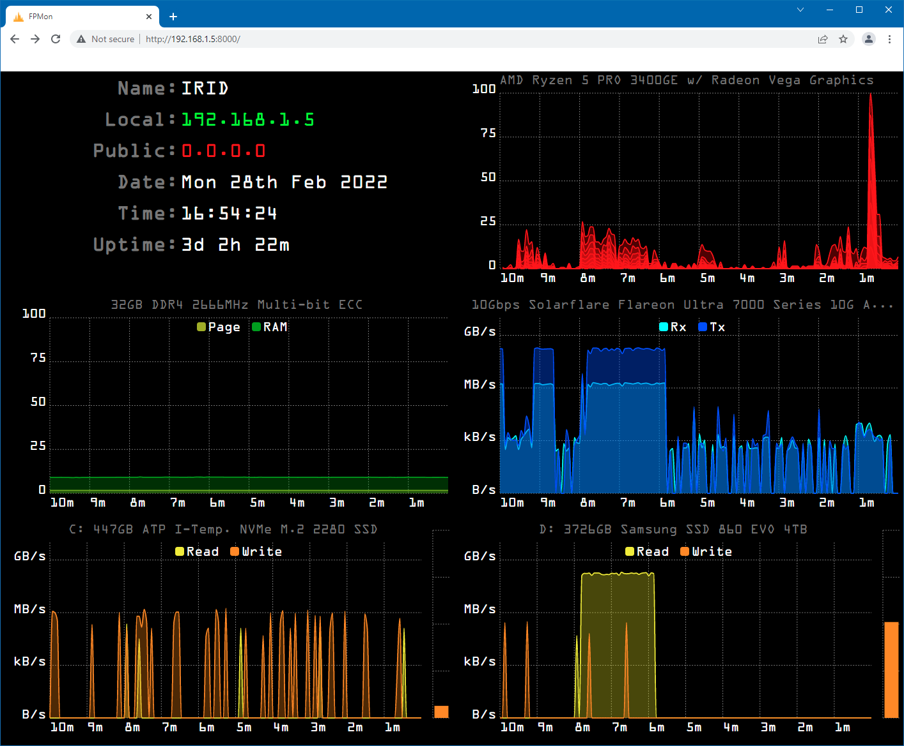

# Front Panel Monitor 2

[FPMon2](https://mrevil.asvachin.com/comp/fpmon2) is a server monitoring tool to plot a few important statistics on charts.

## Limitations

FPMon2 was made specifically for my own use and so may not work well for anyone else. In particular it has limitations such as:

* Exactly 4:3 aspect ratio.
* Assumes two local drives.
* Assumes a single network adapter with a single IP address.
* Only shows IPv4 addresses, not IPv6.
* Some things don't display properly in a VM, like memory type.

This also means that I don't provide support. Feel free to raise issues, but don't expect anything to come of them.

## Requirements

* Python 3.8+ (it might work with earlier versions of Python 3 too).
* Windows 10 (possibly Windows 8 too, but definitely not 7).
* A new-ish web browser.
* A display of at least 640x480 resolution (it was designed for that resolution to fit on an embedded monitor, though it will scale up to at least 4k).

## Installation

* Extract the zip somewhere. The log file is written to the install directory, so it should be placed somewhere that doesn't need admin rights to write to, i.e. not _/Program Files/_.
* Double-click _Main.py_ to start the server.
* Go to http://localhost:8000 in a web browser to view the charts.

Please note that FPMon2 should not be exposed directly to the internet, as it has no security built in at all - no password, no SSL, and Python's _HTTPServer_ is not designed for that. Use a VPN or reverse proxy if you want to access it from the internet.
